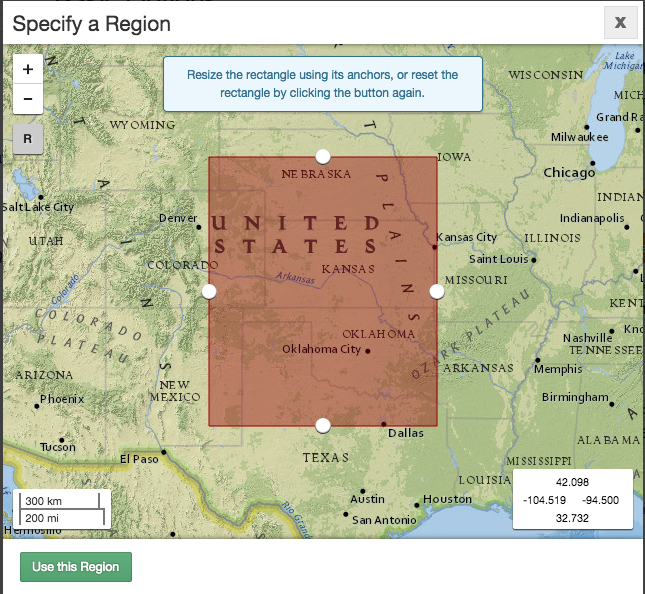
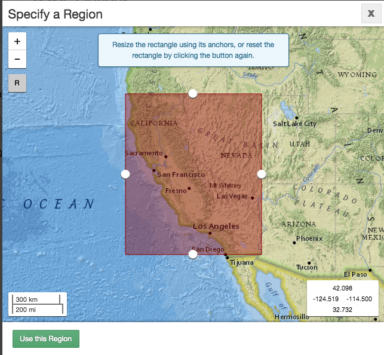
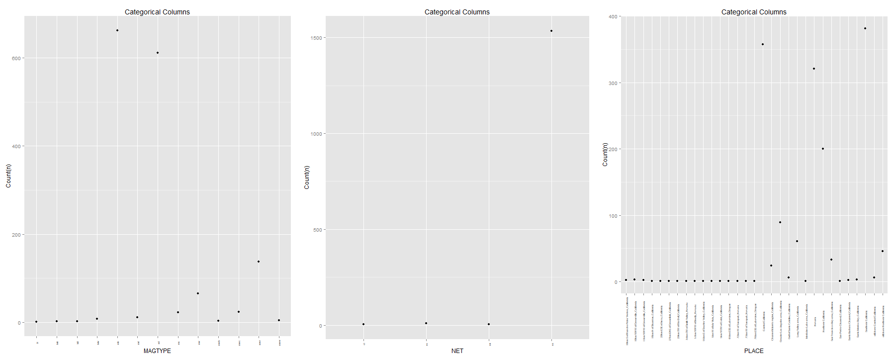
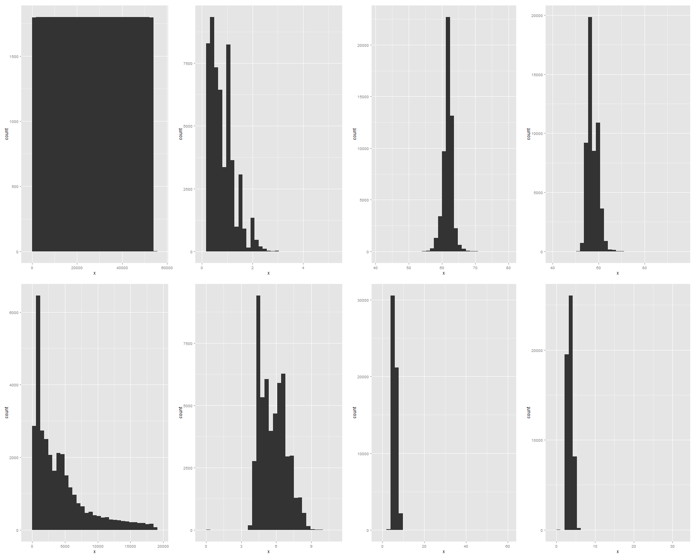

In this R Markdown document we will display and document each step of CS329e R Project .

Project Requirements <http://www.cs.utexas.edu/~cannata/dataVis/Projects/R%20Project%203/R%20Project%20Requirements.html>.

In the source folder 01 Data, the R script Access Oracle Database.R was created to connect to Dr. Cannata's Orcale database and generate a data frame from the uploaded Vocabulary.csv file. The RCurl and jsonlite package were loaded to allow general HTTP requests and process the results returned by the Web server.

Describe  joined datasets.


```{r}
source("../01 Data/Access Oracle Database.R", echo = TRUE)
```

A second R script  subset.R was created to display the vocab data frame that was previously created in the last step. The head(), tail(), tbl_df(), glimpse(), and summary() functions were used to return subsets of this data frame. 
 
 
 

```{r}
source("../01 Data/Subset Data.R", echo = TRUE)

```

In this data wrangling section, several work flows are constructed using the %>% pipe operator which revealed new information about the data set.

```{r}
source("../02 Data Wrangling/Joining Data.R", echo = TRUE)
```

Create these visualizations using Beautiful Plotting.

```{r setup, results='asis'}
#source("../03 Visualizations/hook.R", echo = TRUE)
```

**If you do not see a spinnable 3d plot.** 
1. Navigate to the top of the page
2. Click Open in Browser 
3. Accept the Allow blocked content warning
4. Scroll down and you should see a spinnable 3d plot of the entire Vocabulary data set.
**NOTE: This works for Windows**
```{r testgl, webgl=TRUE}
#source("../03 Visualizations/plot3d.R", echo = TRUE)
```

This is a scatterplot matrix with hotgrams along the diagonal.

```{r}
#source("../03 Visualizations/Matrix.R", echo = TRUE)
```

13.Include in your html file a PNG image that shows a characterization of the categorical columns (as group by plots) and measure columns (as histograms)

```{r}
#source("../03 Visualizations/PNG .R", echo = TRUE)
```


 
 
