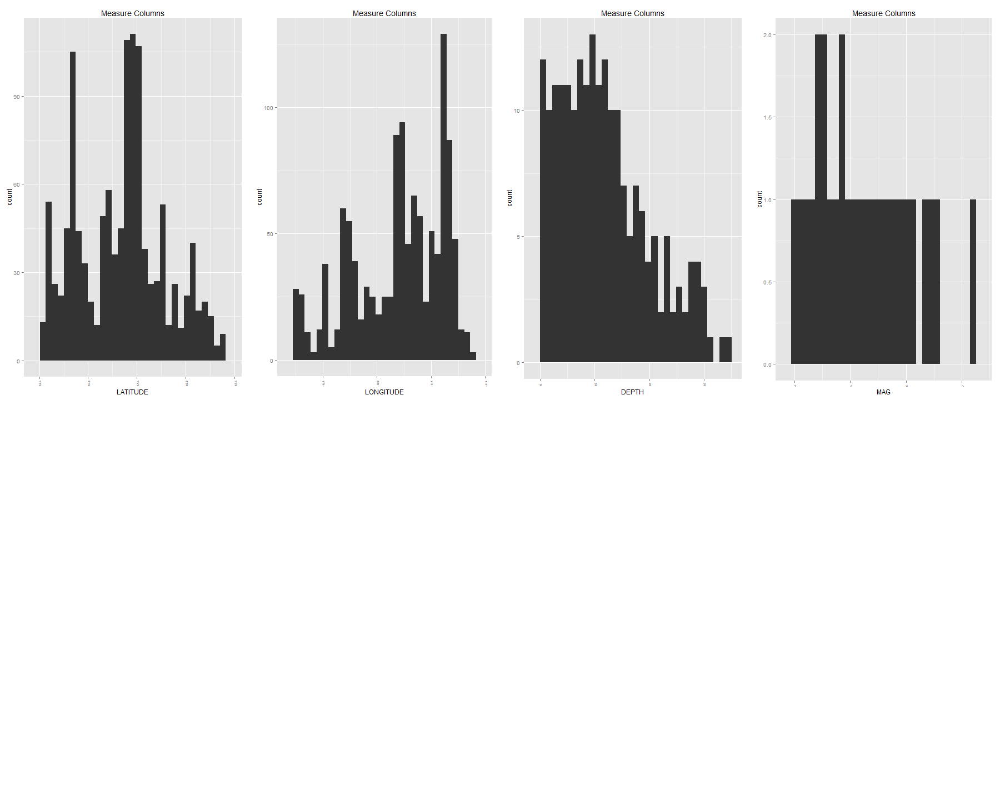

In this R Markdown document we will display and document each step of CS329e R Project .

Project Requirements <http://www.cs.utexas.edu/~cannata/dataVis/Projects/R%20Project%203/R%20Project%20Requirements.html>.

In the source folder 01 Data, the R script Access Oracle Database.R was created to connect to Dr. Cannata's Orcale database and generate a data frame from the uploaded Vocabulary.csv file. The RCurl and jsonlite package were loaded to allow general HTTP requests and process the results returned by the Web server.

Describe  joined datasets.

* The initial graph is shows the locations of earthquakes with magnitude above 4 in both the east coast and southern part of the United States
* The picture of the red box around Oklahoma is our dataset is a visual representation of where we got our dataset for the South
* The picture of the red box around California is our dataset is a visual representation of where we got our dataset for the East Coast
* Next graph is a visual representation of a left join bewteen California and Oklahoma area based on Magnitude
* Next graph is a visual representation of a right join bewteen California and Oklahoma area based on Depth
* Next graph is a visual representation of a inner join bewteen California and Oklahoma area based on Magnitude
* Next graph is a visual representation of a full join bewteen California and Oklahoma area based on Depth
* Next graph is a visual representation of a semi oin bewteen California and Oklahoma area based on Magnitude
* Next graph is a visual representation of a anti join bewteen California and Oklahoma area based on Depth
* Next graph is a visual representation of a bind rows bewteen California and Oklahoma where the x is Latitude and Y is Longitude.  This shows in a unique way how most of the earthquakes occur in one area which is the Eastern Coast.


```{r}
source("../01 Data/Access Oracle Database.R", echo = TRUE)
```

A second R script  subset.R was created to display the vocab data frame that was previously created in the last step. The head(), tail(), tbl_df(), glimpse(), and summary() functions were used to return subsets of this data frame. 
 
 
 

```{r echo=TRUE, warning=FALSE}
source("../01 Data/Subset Data.R", echo = TRUE)

```

In this data wrangling section, several work flows are constructed using the %>% pipe operator which revealed new information about the data set.  

```{r echo=TRUE, warning=FALSE}
source("../02 Data Wrangling/Joining Data.R", echo = TRUE)
```

Here are our Beautiful Graphs.

*The first graph shows the typical range and medium of magnitudes per state. Outliers are also shown. 
*The second graph shows the number of earthquakes above magnitude 4 that have occurred since 1950 in the selected state.  This exemplifies just how many powerful earthquakes have occurred in California compared to the other states.  

```{r echo=TRUE, warning=FALSE}
source("../02 Data Wrangling/Data Wrangling.R", echo = TRUE)
```

13.Include in your html file a PNG image that shows a characterization of the categorical columns (as group by plots) and measure columns (as histograms)

```{r echo=FALSE, warning=FALSE}
source("../03 Visualizations/PNG .R", echo = TRUE)
```
Below are PNG images that shows a characterization of the categorical columns (as group by plots) and measure columns (as histograms) for my main table
 
 
